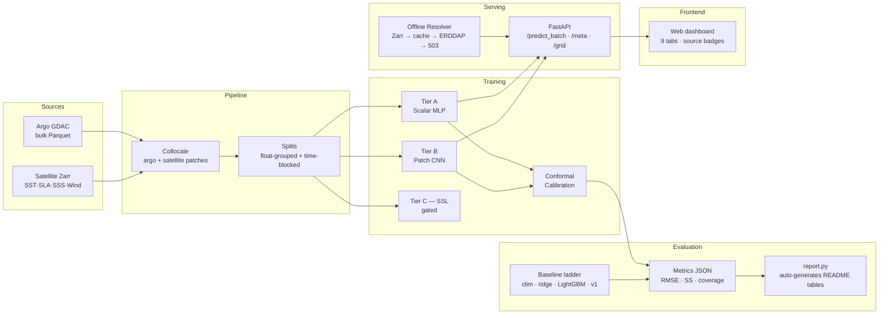

# Architecture

```mermaid
flowchart LR
    subgraph Sources
        A[Argo GDAC\nbulk Parquet]
        S[Satellite Zarr\nSST·SLA·SSS·Wind]
    end
    subgraph Pipeline
        C[Collocate\nargo + satellite patches]
        SP[Splits\nfloat-grouped + time-blocked]
    end
    subgraph Training
        TA[Tier A\nScalar MLP]
        TB[Tier B\nPatch CNN]
        TC[Tier C — SSL\ngated]
        CAL[Conformal\nCalibration]
    end
    subgraph Evaluation
        BL[Baseline ladder\nclim · ridge · LightGBM · v1]
        M[Metrics JSON\nRMSE · SS · coverage]
        RPT[report.py\nauto-generates README tables]
    end
    subgraph Serving
        API[FastAPI\n/predict_batch · /meta · /grid]
        RES[Offline Resolver\nZarr → cache → ERDDAP → 503]
    end
    subgraph Frontend
        UI[Web dashboard\n9 tabs · source badges]
    end

    A --> C
    S --> C
    C --> SP
    SP --> TA & TB & TC
    TA & TB --> CAL
    CAL --> M
    BL --> M
    M --> RPT
    TA & TB --> API
    RES --> API
    API --> UI
```

See `MODEL_CARD.md`, `DATA_CARD.md`, and `REPRODUCE.md` for detailed documentation.
